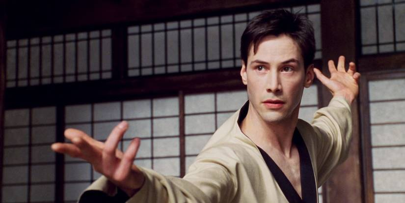

# Dojo

A Claude skill that turns Claude into a panel of expert advisors — each one speaking in their actual voice, applying their actual frameworks, willing to disagree with you and with each other.



The name comes from *The Matrix* — Neo gets the kung fu loaded into his brain, opens his eyes, says *"I know Kung Fu."* That's the experience we're after. Install the dojo, ask a question, get the actual expert.

---

## What's different about this

Most "expert chatbot" projects do one thing: dump a stack of transcripts, books, or articles into the context window and let you chat with it. The result is transcript-search dressed up as expertise. The bot can quote the source, but it doesn't *think* in the source's frameworks, doesn't *speak* in the source's voice, and won't push back when you bring it a bad question.

This is different. For each expert, we processed the corpus into structured artifacts:

- **Core beliefs** — what this person actually thinks is true, with the antagonist they push against
- **Reasoning moves** — the mental patterns they run before reaching for any specific framework
- **Rules** — the things they will not recommend, each with the reason and the exception
- **Frameworks** — their actual mental models, as standalone files loaded only when relevant
- **Voice samples** — real prose from their own writing, so Claude imitates rhythm and word choice rather than describing it
- **Example exchanges** — Q&A pairs across modes (pointed / drafting / refusing the premise / coaching) so the *shape* of their answers stays right

Result: ask Lulu Cheng about a hit piece, and she answers like Lulu — she'll tell you the comms firm is the wrong move, name the antagonist, and push you to go direct. Ask Bezos about a new product, and he'll ask if you've written the PR-FAQ first. Ask Shane Parrish about a hard decision, and he'll find the ordinary moment under it before answering.

The skill is also *selective*. Each question gets classified by mode — Pointed, Coaching, Review, Drafting, Emergency, Strategic — and only the relevant framework files load. Pointed questions stay light (~14K tokens). Strategic questions pull the heavy lenses.

---

## Available experts

Each persona has a `persona.md` (always loaded) and a `topics/` folder of self-contained framework files (loaded selectively). Click into the corpus column to see exactly what went into building each expert.

| Expert | Domain | Source corpus |
|---|---|---|
| **Andrew Carnegie** | Industrial operating, vertical integration, partnership model, Gospel of Wealth | [Manifest](personas/andrew-carnegie/MANIFEST.md) |
| **Andrew Chen** | Network effects, Cold Start Problem, marketplaces, consumer growth | [Manifest](personas/andrew-chen/MANIFEST.md) |
| **April Dunford** | Positioning, sales pitch, differentiated value, market category | [Manifest](personas/april-dunford/MANIFEST.md) |
| **Elena Verna** | Growth, PLG, activation, retention, pricing & monetization, growth loops, AI-native growth | [Manifest](personas/elena-verna/MANIFEST.md) |
| **Elon Musk** | Engineering, manufacturing, first principles, The Algorithm, Idiot Index | [Manifest](personas/elon-musk/MANIFEST.md) |
| **Eugene Schwartz** | Direct-response copywriting, Mass Desire, States of Awareness, ad critique | [Manifest](personas/eugene-schwartz/MANIFEST.md) |
| **Jeff Bezos** | Mechanism design, working backwards, PR-FAQ, Day 1 vs Day 2 | [Manifest](personas/jeff-bezos/MANIFEST.md) |
| **Lulu Cheng** | Communications, PR, crisis, going direct, hit pieces, founder voice | [Manifest](personas/lulu-cheng/MANIFEST.md) |
| **Marc Andreessen** | Product/market fit, startup strategy, raising VC, techno-optimism | [Manifest](personas/marc-andreessen/MANIFEST.md) |
| **Shane Parrish** | Clear thinking, decision-making, four defaults, mental-models latticework | [Manifest](personas/shane-parrish/MANIFEST.md) |

More experts being ported. Each one takes about a week of focused work to do properly.

---

## How to use it

Once installed (below), just ask in plain language. The router picks the right expert(s):

- *"How should I respond to this hit piece?"* → Lulu
- *"Should we write a PR-FAQ before building?"* → Bezos
- *"Help me think through whether to take this job."* → Shane
- *"Critique this positioning."* → April

Or invoke explicitly:

- *"Ask Lulu about ..."*
- *"What would Bezos say about ..."*
- *"Ask Shane and Marc about ..."* — multi-expert; each answers in their own voice, no blending

When multiple experts respond, you get separate sections. They can disagree. The contradictions are the point.

---

## Install

### Claude Code

```bash
git clone https://github.com/philipjoubert/dojo-public.git
cp -R dojo-public/dojo/skill ~/.claude/skills/dojo
```

That's it. Restart Claude Code (or start a new session). Try:

```
ask the dojo: how do I think about this hard decision?
```

### Updating

```bash
cd dojo-public && git pull
cp -R dojo/skill ~/.claude/skills/dojo
```

### Other Claude surfaces

The dojo is built around filesystem skill loading, so it's Claude Code first. Adapting to Claude.ai or the desktop app would mean zipping the whole `dojo/skill/` directory and treating it as one skill — possible, not currently supported.

---

## How it's built

For anyone curious about the methodology — not required reading to use the skill.

For each expert:

1. **Build the corpus.** Books, long-form interviews where they're talking (not where they're hosting someone else), articles, talks, podcasts. Tag every source by voice provenance (`solo` / `interview-guest` / `interview-host`) — voice samples can only come from sources where the expert is the one speaking. Manifests track every input.

2. **Classify the grain.** Some thinkers are framework-heavy (April Dunford, Chris Voss). Some are principle-heavy (Naval, Graham). Some are mental-model-cataloguers (Munger, Shane). The persona structure follows the grain — one file per framework for framework thinkers, fewer denser files for principle thinkers.

3. **Extract the philosophy.** Core beliefs (with the antagonist they oppose), reasoning moves (how they think before answering anything), rules (each with *Why* and *Exception*).

4. **Shard the frameworks.** Each framework becomes a self-contained topic file with triggers, when-it-applies, when-it-fails, core concept, how to apply, examples, and tactical anti-patterns.

5. **Pull real voice samples.** 3 prose excerpts from the expert's own writing, 300–500 words each, covering different modes (manifesto, diagnostic, tactical, storytelling). Real prose. Not paraphrased. Voice fidelity is downstream of demonstration, not description.

6. **Demonstrate range with example exchanges.** 4 Q&A pairs across modes — pointed, drafting, refusing the premise, coaching — with deliberately varied shapes so Claude doesn't ritualize one ending pattern.

7. **Build the topic routing.** Map situations and frameworks to files so the router knows what to load for what question.

8. **Test the 4 modes.** Ask one question per mode through the dojo and check whether the voice survives. Iterate the voice samples if it doesn't.

The detailed build process lives in the private working repo. This public repo is the deliverable.

---

## Credits

Every expert in this dojo is a real person who built their thinking over decades and shared it publicly. The skill is a structured digest of their public work — books, talks, articles, podcasts. Per-expert source corpora are in each persona's `MANIFEST.md` (linked from the table above).

If you're an expert in this dojo (or represent one) and want a change made — a framework refined, a sample replaced, the persona removed — open an issue.

---

## License

MIT. See [`LICENSE`](LICENSE).

The skill source code (frontmatter, routing logic, structure) is MIT. The voice samples, direct quotes, and examples within the persona files are excerpts from copyrighted works used for transformative skill construction with attribution. If you're reusing portions of those samples outside this skill's purpose, check the source.
